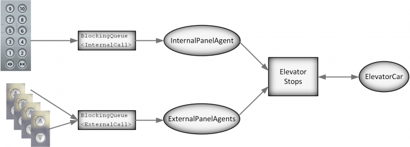

# Laboratorium 12 - Wątki: operacje równoległe, winda

## 12.1 Operacje równoległe

Zrealizujemy przykład, w którym obliczana będzie średnia wartości zgromadzonych w tablicy.

### Mean

Zadeklaruj klasę `Mean`, której statycznym atrybutem będzie tablica `double[]` wypełniona losowymi elementami. W testowanych przykładach ta tablica będzie długa, np. będzie miała 100 mln elementów.

```java
public class Mean {
    static double[] array;
    static void initArray(int size) {
        array = new double[size];
        for (int i = 0; i < size; i++) {
            array[i] = Math.random() * size / (i + 1);
        }
    }
 
    public static void main(String[] args) {
        initArray(100000000);
    }
}
```

### Wątek MeanCalc
Wątek `MeanCalc` otrzyma w konstruktorze dwa indeksy: `start` i `end` i obliczy średnią dla elementów tablicy `array` pomiędzy `start` (włącznie) i `end` (wyłącznie). Zakładając, że tablicę podzielimy na bloki tej samej długości i każdy z nich będzie obsłużony przez jeden wątek, będzie mozna następnie obliczyć średnią z wartości zwróconych przez poszczególne wątki. Zadeklaruj `MeanCalc` jako klasę zagnieżdżoną wewnątrz `Mean`

```java
static class MeanCalc extends Thread {
    private final int start;
    private final int end;
    double mean = 0;

    MeanCalc(int start, int end) {
        this.start = start;
        this.end = end;
    }
    public void run() {
        // liczymy średnią
        System.out.printf(Locale.US, "%d-%d mean=%f\n", start, end, mean);
    }
}
```

### Uruchamianie wątków i liczenie średnich - parallelMean() v.1

Napisz funkcję `parallelMean()`

```java
/**
 * Oblicza średnią wartości elementów tablicy array uruchamiając równolegle działające wątki. 
 * Wypisuje czasy operacji
 * @param cnt - liczba wątków
 */
static void parallelMean(int cnt) {
    // utwórz tablicę wątków
    MeanCalc threads[] = new MeanCalc[cnt];
    // utwórz wątki, podziel tablice na równe bloki i przekaż indeksy do wątków
    // załóż, że array.length dzieli się przez cnt)
    double t1 = System.nanoTime() / 1e6;
    //uruchom wątki
    double t2 = System.nanoTime() / 1e6;
    // czekaj na ich zakończenie używając metody join
    for(MeanCalc mc : threads) {
        mc.join();
    }
    // oblicz średnią ze średnich
    double t3 = System.nanoTime() / 1e6;
    System.out.printf(
        Locale.US,
        "size = %d cnt=%d >  t2-t1=%f t3-t1=%f mean=%f\n",
        array.length, 
        cnt,
        t2 - t1,
        t3 - t1,
        mean
    );
}
```

Wywołaj w `main()` funkcje `initArray()` i `parallelMean()` z różnymi parametrami i porównaj czasy.

### parallelMean() v.2

Synchronizacja za pomocą `join()` nie jest szczególnie wygodna. Bardziej naturalne jest użycie

- semafora (jezeli zalezy nam wyłącznie na synchronizacji)
- kolejki wiadomości, jeżeli zainteresowani jesteśmy rezultatami obliczonymi przez wątki

Wypróbujemy rozwiązanie z kolejką. Kolejka ma dwie interesujące nas metody:

- `put()` - dodaje element do kolejki, blokuje wątek jeśli jest pełna
- `take()` - zwraca element z kolejki, blokuje wątek, jeśli jest pusta

### Deklaracja

Zadeklaruj w klasie `Mean`

```java
static BlockingQueue<Double> results = new ArrayBlockingQueue<Double>(100);
```

### Wywołanie put()

Umieść w klasie `MeanCalc` – po wyznaczeniu częściowej średniej prześlij ją do kolejki.

### Wywołanie take()

Umieść w `parallelMean()` po uruchomieniu wątków.

- W pętli odczytaj tyle wartości z kolejki, ile uruchomiłeś wątków.
- Wyznacz średnią z tych wartości
### Dla ilu wątków czas przetwarzania będzie najmniejszy?

```java
public static void main(String[] args) {
    initArray(128000000);
    for (int cnt : new int[]{1,2,4,8,16,32,64,128}) {
        parallelMean(cnt);
    }
}
```

Sprawdź, czy dla każdej wartości `cnt` uzyskiwana jest ta sama średnia...

## 12.2 Winda

Sterowniki urządzeń są typowym przykładem systemów, które są implementowane jako programy współbieżne. Należą do nich, na przykład: systemy dostępu, automatyczny parking, inteligentny dom, sprzęt AGD i RTV, systemy alarmowe, elektronika samochodu, urządzenia medyczne.

Zazwyczaj takie systemy implementuje się w postaci kilku(nastu) komunikujących się wątków (zadań) działających nieprzerwanie. Są one odpowiedzialne za reakcje na zdarzenia generowane przez urządzenia wejściowe (przyciski i czujniki) oraz realizację sterowania i generację akcji wyjściowych.

Często stosowane są dwa wzorce komunikacji.

1. Każdy z wątków ma własną wejściową kolejkę komunikatów. Wątek czeka na pojawienie się komunikatu w kolejce, po jego pojawieniu się wątek zostaje odblokowany przez system operacyjny, obsługuje komunikat i przechodzi z powrotem w stan oczekiwania (zablokowania)
2. Watki korzystają z dzielonej pamięci (np. tablic umieszczonych w pamięci). Dostęp do tych danych wymaga jednak zastosowania mechanizmu wzajemnego wykluczania. Wątki mogą realizować dostęp cyklicznie (np. sprawdzać co 500ms, jaki jest stan pamięci).
Zrealizujemy przykład sterownika windy. Obiekty składowe pokazane są na rysunku.



- `ElevatorStops` – klasa zawiera dwie tablice `boolean[]`. Jedna przechowuje informacje o wezwaniach przy ruchu w góre, druga przy ruchu w dół. Jest to dzielony zasób, dostęp do niego powinien być zabezpieczony.
- `ElevatorCar` – jest to właściwy sterownik kabiny windy. Odczytuje cyklicznie dane w `ElevatorStops` i podejmuje decyzje o ruchu lub zatrzymaniu
- Winda ma dwa panele: wewnętrzny i zewnętrzne (na każdym piętrze). Nacisnięcie przycisku na panelu zewnętrznym (wewnętrznym) powoduje przesłanie komunikatu do kolejki wejściowej wątku `ExternalPanelsAgent` (lub odpowiednio `InternalPanelAgent`).
- Wątek `ExternalPanelsAgent` oczekuje na komunikat w kolejce. Po jego pojawieniu się zapisuje wezwanie do jednej z tablic w `ElevatorStops`.
- Wątek `InternalPanelAgent` działa analogicznie
- Tak naprawdę (co nie jest widoczne) zmienną dzieloną jest także aktualny numer pietra będący atrybutem klasy `ElevatorCar`

### Klasa ElevatorStops

Kod jest prawie gotowy...

**Do uzupełnienia** :heavy_exclamation_mark: Dodaj elementy, które zagwarantują, że klasa będzie singletonem

- nie można utworzyć obiektu klasy na zewnątrz
- funkcja get() ma zwracać jedyną instancję klasy

```java
public class ElevatorStops {
    static final int FLOORS = 10;
    static final int MIN_FLOOR = 0;
    static final int MAX_FLOOR=FLOORS-1;
    boolean stopsDown[] = new boolean[FLOORS];
    boolean stopsUp[] = new boolean[FLOORS];
 
 
    void setLiftStopUp(int floor) {
        stopsUp[floor]=true;
    }
    void setLiftStopDown(int floor) {
        stopsDown[floor]=true;
    }
    void clearStopUp(int floor) {
        stopsUp[floor]=false;
    }
    void clearStopDown(int floor) {
        stopsDown[floor]=false;
    }
 
 
    boolean hasStopAbove(int floor) {
        for(int i=floor+1;i<MAX_FLOOR;i++) {
            if(stopsUp[i] || stopsDown[i])return true;
        }
        return false;
    }
    boolean hasStopBelow(int floor) {
        for(int i=floor-1;i>=MIN_FLOOR;i--) {
            if(stopsUp[i] || stopsDown[i])return true;
        }
        return false;
 
    }
 
    int getMaxSetFloor() {
        for(int i=MAX_FLOOR-1;i>=0;i--) {
            if(stopsUp[i]||stopsDown[i])return i;
        }
        return 0;
    }
    int getMinSetFloor() {
        for(int i=0;i<MAX_FLOOR;i++) {
            if(stopsUp[i]||stopsDown[i])return i;
        }
        return 0;
    }
 
    boolean whileMovingDownSholudStopAt(int floor) {
        return stopsDown[floor];
    }
    boolean whileMovingUpSholudStopAt(int floor) {
        return stopsUp[floor];
    }
    static ElevatorStops get() {
        return ???
    }
}
```

`ElevatorStops` jest dzielonym zasobem. Przy dostępie współbieżnym potencjalnie istnieje ryzyko wprowadzenia zasobu w stan niespójności. Tutaj ryzyko jest niewielkie, ponieważ są to tablice `boolean[]`, w których zmieniane lub odczytywane są pojedyncze wartości. Gdyby jednak zasób miał zostać zabezpieczony, stosowanym w Javie rozwiązaniem jest zadeklarowanie metod dostępu jako synchroniczne (słowo kluczowe `synchronized`). Jakie byłyby konsekwencje zmiany sposobu implementacji?

### Klasa ElevatorCar

W obiekcie klasy jest przechowywana informacja o numerze piętra (atrybut `floor`).

Stan obiektu jest kombinacją dwóch zbiorów stanów:

- Kierunku ruchu `enum Tour {UP, DOWN};`
- Stanu ruchu lub spoczynku `enum Movement {STOP, MOVING};`

```java
public class ElevatorCar extends Thread {
    int floor = 0;
 
    public int getFloor() {
        return floor;
    }
 
    enum Tour {UP, DOWN};
    Tour tour = Tour.UP;

    enum Movement {STOP, MOVING};
    Movement movementState = Movement.STOP;
}
```

Sterowanie jest zrealizowane wewnątrz metody `run()`. Sterownik windy powinien

- w zależności od stanu windy: `floor`, `tour` i `movementState`
- w zalezności od stanu zgłoszeń `ElevatorStops`

podejmować decyzje o kierunku jazdy i czy winda ma być w ruchu

Zasady:

- winda jadąc w górę zatrzymuje się w miejscach zgłoszeń w górę
- po dojechaniu do ostatniego zmienia kierunek i zaczyna realizować zlecenia w dół
- jeżeli nie ma wezwań, winda stoi (inna polityka: zjeżdża na parter)

```java
public void run() {
    for (;;) {
        // sleep(500);
    }
}
```

### Klasa ExternalPanelsAgent

Klasa definiuje zagnieżdżoną klasę komunikatów `ExternalCall`, które mają trafiać do kolejki wejściowej. Ponieważ potrzebuje informacji o pietrze - odczytuje wartość `floor` z `ElevatorCar`.

```java
public class ExternalPanelsAgent extends Thread {
 
    private final ElevatorCar elevatorCar;
 
    static class ExternalCall {
        private final int atFloor;
        private final boolean directionUp;
 
        ExternalCall(int atFloor,boolean directionUp) {
            this.atFloor = atFloor;
            this.directionUp = directionUp;
        }
    }
    BlockingQueue<ExternalCall> input = new ArrayBlockingQueue<ExternalCall>(100);
    ExternalPanelsAgent(ElevatorCar elevatorCar) {
        this.elevatorCar = elevatorCar;
    }
 
    public void run() {
        for (;;) {
            ExternalCall ec = ec = input.take();
            // ignorujemy wezwanie na piętro, na którym winda się znajduje 
            if (ec.atFloor == elevatorCar.getFloor()) continue;
            // dodajemy do jednej z tablic zgłoszeń
            if (ec.directionUp) {
                ElevatorStops.get().setLiftStopUp(ec.atFloor);
            } else {
                ElevatorStops.get().setLiftStopDown(ec.atFloor);
            }
        }
    }
}
```

### Klasa InternalPanelAgent

Napisz ją w podobny sposób

```java
public class InternalPanelAgent extends Thread {
    static class InternalCall{
        private final int toFloor;
        InternalCall(int toFloor) {
            this.toFloor = toFloor;
        }
    }
 
    InternalPanelAgent(ElevatorCar elevatorCar) {
        this.elevatorCar = elevatorCar;
    }
 
    BlockingQueue<InternalCall> input = new ArrayBlockingQueue<>(100);
    ElevatorCar elevatorCar;
 
    public void run() {
        for (;;) {
          // odczytaj wezwanie z kolejki
          // w zależności od aktualnego piętra, na którym jest winda,  
          // umieść przystanek w odpowiedniej tablicy EleveatorStops 
        }
    }
}
```

### Klasa Elevator

Klasa `Elevator` łączy wszystkie elementy

```java
public class Elevator {
    // tworzymy 3 wątki
    static ElevatorCar car = new ElevatorCar();
    static ExternalPanelsAgent externalPanelAgent = new ExternalPanelsAgent(car);
    static InternalPanelAgent internalPanelAgent = new InternalPanelAgent(car);
 
    // symulacja przywołania windy z panelu zewnętrznego 
    static void makeExternalCall(int atFloor, boolean directionUp) {
        try {
            externalPanelAgent.input.put(new ExternalPanelsAgent.ExternalCall(atFloor, directionUp));
        } catch (InterruptedException e) {
            e.printStackTrace();
        }
    }
 
    // symulacja wyboru pietra w panelu wewnętrznym 
    static void makeInternalCall(int toFloor) {
        try {
            internalPanelAgent.input.put(new InternalPanelAgent.InternalCall(toFloor));
        } catch (InterruptedException e) {
            e.printStackTrace();
        }
    }
    // uruchomienie wątków
    static void init() {
        car.start();
        externalPanelAgent.start();
        internalPanelAgent.start();
    }
 
    // miesjce na kod testowy
    public static void main(String[] args) {
        init();
        makeExternalCall(4, false);
        Thread.currentThread().sleep(100);
        makeInternalCall(2);
    }
}
```

Przetestuj różne sekwencje wywołań i sprawdź czy winda zachowuje się poprawnie. Napisz co najmniej 5 różnych scenariuszy (sekwencji wywołań). W przypadku błędnego działania - popraw kod w `ElevatorCar`.

Winda powinna:

- Jadąc do góry:
  - zatrzymywać się na piętrach, na których na panelu zewnętrznym wybrano kierunek jazdy do góry
  - zatrzymywać się na pietrach wybranych na panelu wewnętrznym
  - wybrane wewnątrz pietra poniżej bieżącego wprowadzać do tablicy przystanków podczas jazdy w dół
- Analogicznie, podczas jazdy w dół
